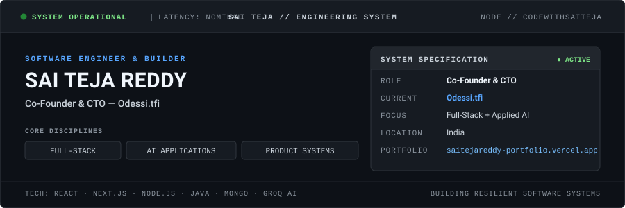

<div align="center">

<picture>
  <source media="(prefers-color-scheme: dark)" srcset="./profile/hero-dark.svg" />
  <source media="(prefers-color-scheme: light)" srcset="./profile/hero-light.svg" />
  
</picture>

</div>

<br/>

```text
========================================================================================
SYSTEM SPECIFICATION // SAI TEJA REDDY
----------------------------------------------------------------------------------------
ROLE         Co-Founder & CTO — Odessi.tfi
FOCUS        Full-Stack Systems · Applied AI Architectures · Product Engineering
STACK        React · Next.js · Node.js · Express · Java · MongoDB · Groq AI
LOCATION     India
PORTFOLIO    https://saitejareddy-portfolio.vercel.app/
STATUS       OPERATIONAL // ACTIVE BUILDS
========================================================================================
```

---

## 01 // CURRENT BUILD

### Odessi.tfi
**Role:** Co-Founder & CTO  
**Domain:** Premium fashion e-commerce platform  
**Platform Reference:** [saitejareddy-portfolio.vercel.app](https://saitejareddy-portfolio.vercel.app/)

Leading core technical architecture and platform execution. Currently engineering foundational e-commerce subsystems with emphasis on transactional integrity, catalog performance, and customer journey reliability.

| Subsystem | Architectural Scope | Status |
| :--- | :--- | :--- |
| `AUTHENTICATION` | Session lifecycle, token rotation, role-based authorization | `ACTIVE` |
| `PRODUCTS` | Catalog schema, multi-variant indexing, normalized query resolution | `ACTIVE` |
| `INVENTORY` | Real-time stock reservation, ledger consistency, threshold guards | `BUILDING` |
| `CHECKOUT` | Cart validation, idempotent checkout session state machine | `BUILDING` |
| `ORDERS` | Order lifecycle pipeline, dispatch states, invoice generation | `BUILDING` |
| `PAYMENTS` | Payment gateway integration, signature verification, webhooks | `EXPLORING` |
| `ADMINISTRATION` | Merchant operations dashboard, catalog controls, telemetry | `EXPLORING` |

---

## 02 // PROJECT ARCHIVE

```text
INDEX  PROJECT                         ARCHITECTURE                          SIGNALS & METRICS
[01]   SNAPBUY                         MERN · Groq AI · Razorpay · JWT       14+ Intents · 1,260+ Products · 90% Success
[02]   CODESMART                       React · Monaco · Node.js · Groq AI    7 Core AI Workflows · ~30% Debug Efficiency
[03]   GST MANAGEMENT SYSTEM           React · Express · MongoDB · bcrypt    4 Assigned Modules · 90% Test Success
[04]   SMART EVENT MANAGEMENT          MERN · REST APIs · RBAC               5 Core Workflows · 10+ REST APIs · 90% Test Success
```

### `01` SnapBuy — Conversational Commerce Platform
Natural-language product discovery and automated checkout pipeline powered by LLM intent extraction.

- **Domain:** Conversational AI · E-Commerce Systems · Applied LLM
- **Stack:** `MongoDB` · `Express.js` · `React.js` · `Node.js` · `Groq AI` · `Razorpay` · `JWT` · `bcrypt`
- **Engineering Signals:**
  - `14+` distinct conversational shopping intents classified with fallback routing
  - `1,260+` products cataloged across `8` normalized categories
  - `90%` successful intent resolution rate on end-to-end purchasing flows
  - Integrated Razorpay webhooks for idempotent payment status reconciliation
- **Repository:** [`github.com/codewithsaiteja/SnapBuy`](https://github.com/codewithsaiteja/SnapBuy)

### `02` CodeSmart — AI Coding Mentor
Browser-based intelligent development environment providing automated code explanation, debugging, and refactoring.

- **Domain:** Developer Tooling · Code Intelligence · Interactive IDE
- **Stack:** `React.js` · `Monaco Editor` · `Node.js` · `Express.js` · `Groq AI`
- **Engineering Signals:**
  - `7` core AI-assisted workflows (explanation, debugging, optimization, refactoring, complexity analysis, test generation, language conversion)
  - `~30%` reduction in manual debugging turnaround during development benchmarks
  - Streamed token delivery with AST-aware syntax highlighting inside Monaco Editor
- **Repository:** [`github.com/codewithsaiteja/AI-Coding-Mentor`](https://github.com/codewithsaiteja/AI-Coding-Mentor)

### `03` GST Management System — Enterprise Tax Records
Secure financial records platform with role-based validation and persistent audit trails.

- **Domain:** Enterprise Systems · Tax Ledger · Access Security
- **Stack:** `React.js` · `Node.js` · `Express.js` · `MongoDB` · `JWT` · `bcrypt`
- **Engineering Signals:**
  - `4` assigned core functional modules (tax filing, audit trails, entity verification, ledger reports)
  - `90%` integration test pass rate across all protected transaction routes
  - Strict payload validation with salted bcrypt hashing and JWT authorization middleware
- **Repository:** [`github.com/codewithsaiteja/GST---Management-System`](https://github.com/codewithsaiteja/GST---Management-System)

### `04` Smart Event Management System — Operations Platform
Full-stack event scheduling, attendee lifecycle, and administration infrastructure developed during Summer Training.

- **Domain:** Event Operations · Summer Training · RESTful Services
- **Stack:** `React.js` · `Node.js` · `Express.js` · `MongoDB` · `JWT`
- **Engineering Signals:**
  - `5` core business workflows (registration, slot booking, ticketing, attendee check-in, event analytics)
  - `10+` RESTful API endpoints secured with role-based access control (RBAC)
  - `90%` test coverage on core event reservation state transitions
- **Repository:** [`github.com/codewithsaiteja/Smart-Event-Management-System`](https://github.com/codewithsaiteja/Smart-Event-Management-System) *(default branch: `Sai`)*

### Additional Engineering Work
| System | Domain | Architectural Focus | Repository |
| :--- | :--- | :--- | :--- |
| **NOVA** | Project Operations | Task scheduling, deadline tracking, team RBAC | [`nova-project-management`](https://github.com/codewithsaiteja/nova-project-management) |
| **Deadlock Detector** | Systems Simulation | Resource Allocation Graphs, Banker's algorithm safety analysis | [`Automated-Deadlock-Detection-Tool`](https://github.com/codewithsaiteja/Automated-Deadlock-Detection-Tool) |
| **LeetCode Solutions** | Algorithms & DS | 100+ optimized solutions across core data structures | [`leetcode-solutions`](https://github.com/codewithsaiteja/leetcode-solutions) |

---

## 03 // TECHNICAL TAXONOMY

A structured taxonomy of technologies used across production and systems development:

| Category | Technologies & Tools |
| :--- | :--- |
| **Languages** | `Java` · `JavaScript (ES6+)` · `C++` · `C` · `Python` |
| **Application & Backend** | `React.js` · `Next.js` · `Node.js` · `Express.js` |
| **Data Persistence** | `MongoDB` · `MongoDB Atlas` |
| **Web & Runtime** | `HTML` · `CSS` · `Vite` · `WebGL` |
| **Security & Identity** | `JWT (JSON Web Tokens)` · `bcrypt` · `RBAC` |
| **Payments** | `Razorpay` *(SDK, Verification & Webhooks)* |
| **Cloud & Deployment** | `Microsoft Azure` · `Vercel` · `Render` · `Railway` |
| **Version Control & Tooling** | `Git` · `GitHub` · `VS Code` · `Postman` |

---

## 04 // BUILD LOG

```text
2026.09 ─── [ROLE]     ODESSI.TFI ────────────────── Co-Founder & CTO
                       Directing technical roadmap and full-stack commerce infrastructure.

2026.08 ─── [RELEASE]  SNAPBUY ───────────────────── AI Conversational Commerce
                       Shipped 14-intent LLM routing, Groq AI pipeline & Razorpay integration.

2026.07 ─── [TRAINING] SMART EVENT MANAGEMENT ────── Summer Training Capstone
                       Shipped role-based event reservation engine with 10+ RESTful APIs.

2026.05 ─── [RELEASE]  CODESMART ─────────────────── AI Coding Mentor
                       Implemented Monaco editor environment with 7 automated AI workflows.

2026.04 ─── [RELEASE]  GST MANAGEMENT SYSTEM ─────── Tax Ledger & Records
                       Delivered 4 core accounting modules with secure JWT/bcrypt persistence.
```

---

## 05 // ACHIEVEMENT SIGNALS

| Metric / Honor | Designation | Context |
| :--- | :--- | :--- |
| **`Co-Founder & CTO`** | Executive Engineering Role | Leading technical architecture for Odessi.tfi |
| **`100+`** | LeetCode Solved | Algorithms, data structures, and optimized problem solving |
| **`5-Star Gold`** | HackerRank Java | Verified proficiency in Java language & core runtime APIs |
| **`8.22`** | Academic CGPA | B.Tech Computer Science & Engineering, Lovely Professional University |
| **`90.7 %ile`** | NCAT-26 | All-India percentile in National Creative Aptitude Test |

---

## 06 // ACTIVITY / CONTRIBUTION TRAJECTORY

> *Consistency leaves a trace.*

<div align="center">

<picture>
  <source media="(prefers-color-scheme: dark)" srcset="./profile/github-snake-dark.svg" />
  <source media="(prefers-color-scheme: light)" srcset="./profile/github-snake.svg" />
  
</picture>

</div>

---

## 07 // COMMS & VERIFIED ENDPOINTS

```text
PORTFOLIO     https://saitejareddy-portfolio.vercel.app/
LINKEDIN      https://linkedin.com/in/saitejareddy45
GITHUB        https://github.com/codewithsaiteja
EMAIL         saitejareddypamidi@gmail.com
```

| Channel | Endpoint | Focus |
| :--- | :--- | :--- |
| **Portfolio** | [`saitejareddy-portfolio.vercel.app`](https://saitejareddy-portfolio.vercel.app/) | Primary work, product cases, live deployments |
| **LinkedIn** | [`linkedin.com/in/saitejareddy45`](https://linkedin.com/in/saitejareddy45) | Professional background & engineering network |
| **GitHub** | [`github.com/codewithsaiteja`](https://github.com/codewithsaiteja) | Source code, repositories & commit history |
| **Direct Mail** | [`saitejareddypamidi@gmail.com`](mailto:saitejareddypamidi@gmail.com) | Direct engineering inquiries |
